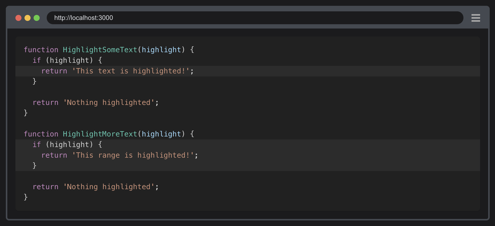

블로그는 [Docusaurus](https://docusaurus.io/)를 사용하여 만들었습니다.

## 작성시 주의사항

- blog, docs 에는 최소 하나 이상 글이 필요합니다.
- blog 에 작성되는 author, tag 정보가 authors.yml, tags.yml 에 등록되어 있지 않으면 빌드시 에러가 발생합니다.

## 참고사항

### 1. 더미 데이터 확인 방법

첫 init 히스토리에 더미 데이터가 추가되어 있습니다. 참고하고 진행하면 됩니다.

### 2. 실행 방법

아래 명령어로 실행하면 됩니다.

```shell
yarn start
yarn build
```

### 3. 헤더는 h2, h3만 사용합니다.

헤더는 h2, h3만 오른쪽 네비게이션에 표시되니 주의해주세요!
다음은 사용 가능한 헤더입니다.

```markdown
## h2
### h3
```

### 4. 코드 하이라이트가 안되는 경우 추가 설정

`docusaurus.config.js` 파일에 


### 5. 라인 하이라이트

아래처럼 [Line highlighting](https://docusaurus.io/docs/markdown-features/code-blocks#line-highlighting) 하는 방식도 있습니다.



highlight-next-line, highlight-start, highlight-end 방식으로 주석을 추가하면 된다.

```plaintext
@Service
public class ExtractJobPostingService {
    public String execute(TargetSource item) throws Exception {
        return switch (item) {
            // highlight-start
            case NAVER -> new NaverJobPostingExtractor(item.getUrl()).extract();
            // highlight-end
            case NHN -> "NHN";
            case KAKAO -> "KAKAO";
        };
    }
}
```
