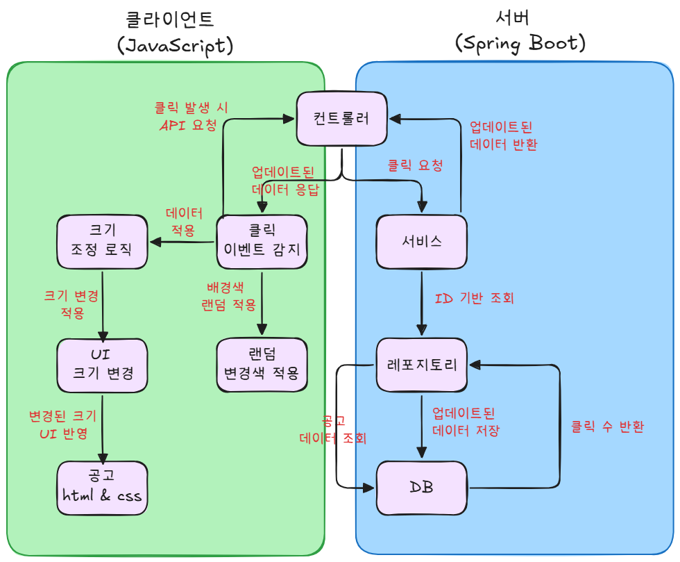

---  
slug: dynamic-job-card-clicks  
title: 초기 설계의 문제점과 원인 분석 개인적인 정리  
authors: [mingseok]  
tags: [서버와 클라이언트 분리]  
---  
  
## 상황  
  
공고의 클릭 수에 따라 크기를 변화시키고, 화면 크기에 맞게 공고를 배치하는 기능을 구현하고자 했다. `처음에는 서버에서 크기와 위치를 계산해 클라이언트로 전달하는 방식을 시도했다.`  
- 이 방식은 서버가 계산을 담당함으로써 클라이언트의 작업량을 줄이고, 데이터의 일관성을 유지할 수 있을 것이라 판단했다.  
- 또한, `공고 크기와 배치 정보를 데이터베이스에 저장하면 다른 사용자와 데이터를 공유하기도 쉬울 것이라고 기대했다.`  
  
그러나 공고의 크기와 배치는 화면 크기나 디바이스 종류에 따라 실시간으로 변해야 하는 동적인 특성을 가지고 있었기 때문에, `서버에서 모든 계산을 처리하는 방식`은 이러한 요구를 충족하지 못해 결국 `실패`로 이어졌다.  
  
## 문제  
  
- 서버에서 공고의 크기와 위치를 미리 계산해 클라이언트로 전달하는 방식은 초기에는 클라이언트의 부담을 줄이고 효율성을 높일 수 있을 것이라 기대했다.  
  - 하지만 실제 구현 과정에서 여러 가지 문제가 발생하며 이러한 접근 방식이 적합하지 않음을 알게 되었다.  
  
### 카드 배치가 제대로 되지 않음  
  
화면 크기와 카드 개수는 사용자 환경에 따라 실시간으로 변화한다.  
  
`데스크톱, 태블릿, 모바일` 등 다양한 화면 크기에서 동일한 UI 경험을 제공하려면, 공고 카드의 크기와 배치가 동적으로 변경되어야 한다. 하지만 `서버에서 고정된 위치와 크기를 미리 계산해 전달하는 방식`은 이러한 요구사항을 충족하지 못했다.  
  
### 실제로, 화면이 축소되거나 확대될 경우  
  
- 배치가 고정된 데이터를 기반으로 하기 때문에 `카드들이 화면 밖으로 넘어가거나 비정상적`으로 겹치는 현상이 발생했다. 이러한 문제는 화면 크기에 따라 동적으로 배치를 조정할 수 없었기 때문에 생긴 문제였다.  
  
### 프론트엔드에서 동적 업데이트의 어려움  
  
- 카드 크기와 위치는 사용자 상호작용에 따라 실시간으로 변화해야 한다.  
- 하지만 서버에서 계산된 고정 데이터를 제공받는 구조에서는 클라이언트가 `화면 크기나 카드 개수 변화에 대응하기 어려웠다.`  
  
### 변화하는 데이터를 고정값으로 제공하는 한계  
  
- 카드의 위치와 크기는 화면 크기, 카드 개수, 사용자 상호작용 등 여러 요인에 의해 매번 달라지는 값이다.  
- 하지만 서버는 이런 데이터를 고정된 형태로 제공했기 때문에 변화에 즉각적으로 대응할 수 없었고, 클라이언트에서 추가적인 처리가 필요했다.  
- `이러한 구조는 동적인 UI를 구현하기에 비효율적이라고 생각했다.`  
  
  
## 원인  
  
### DOM(Tree)과 서버 중심 설계의 충돌  
  
공고 크기와 배치를 서버에서 처리하려 했던 접근 방식이 실패한 이유는 DOM의 동적 특성과 서버에서 제공하는 고정된 데이터를 일치시키기 어려웠기 때문이다.  
  
### DOM에 대해서  
  
- DOM은 `자료구조`다. 웹 페이지의 모든 요소는 계층적인 `트리 구조`로 표현되며, 각 요소는 노드(Node) 로 구성된다.  
  - HTML 문서는 DOM 트리 형태로 브라우저에 의해 해석된다.  
- 스프링에서 내려주면 `DOM 트리가 완성된 상태로 제공`된다.   
  - 즉, 서버에서 HTML을 내려주는 순간 이미 `고정된 형태의 DOM 트리`가 생성된다.  
  
```  
- JavaScript를 활용하면 DOM을 조작하여 동적으로 변경할 수 있다. - 즉, 클라이언트 측에서 UI 요소들을 재배치하거나 스타일을 변경하는 것이 가능하다.
```  
  
## 서버 중심의 공고 크기 & 배치 계산이 실패한 이유  
  
초기 설계에서는 공고 크기와 배치 정보를 서버에서 계산하고, 이를 클라이언트로 전달하는 방식을 사용했다.  
  
- `DOM의 동적 특성을 고려하지 않은 설계`였기 때문에 여러 가지 문제가 발생했다.  
  
### 서버에서 제공하는 데이터는 고정된 DOM 트리에서만 유효하다  
  
- 서버는 공고 크기와 위치를 고정된 값으로 제공했다.  
- 하지만, 브라우저는 다양한 크기의 화면(모바일, 태블릿, 데스크톱)을 가지므로, 고정된 데이터가 다양한 환경에서 항상 유효할 수 없었다.  
  
### 화면 크기 변경 시, 기존 배치를 즉시 반영할 수 없다  
  
- 사용자가 브라우저 창 크기를 변경하면, 기존의 공고 크기 및 위치가 맞지 않는 상황이 발생했다.  
- 서버에서 미리 계산된 고정된 값들은 변경된 화면 크기에 대응할 수 없었기 때문에 `DOM을 조작해서 다시 렌더링할 수 있는 JavaScript가 필요했다.`  
  
### 클라이언트에서 JavaScript를 통해 DOM을 조작해야 했다  
  
- 결국, 클라이언트는 서버에서 제공한 크기와 위치를 강제로 수정해야 했다.  
  
  
## 사용자의 행동이 초래하는 사이드 임팩트  
  
### 화면 크기와 카드 개수의 변화  
  
사용자가 사용하는 화면 크기는 계속 바뀔 수 있다.  
  
- 모바일, 태블릿, 데스크톱 등 다양한 환경에서 작동하려면 화면 `크기에 맞게 카드 크기와 위치`를 실시간으로 조정해야 했다.  
- 그러나 `서버에서 고정된 값을 계산해 전달하는 방식은 이런 변화를 처리할 수 없었다.`  
  
### 서버와 클라이언트의 역할 혼란  
  
- 서버는 데이터를 처리하고 저장하는 데 강점이 있지만, 화면 배치와 같은 UI 관련 작업은 클라이언트가 처리해야 한다.  
- 그러나 모든 계산을 서버에 맡기려다 보니 클라이언트가 해야 할 일을 제대로 처리하지 못했다.  
  
### 데이터 중복 문제  
  
- 위치와 크기 같은 동적으로 변하는 데이터를 데이터베이스에 저장하다 보니, `실제로 필요한 데이터보다 불필요한 데이터가 너무 많이 저장됐다.`  
- 하지만 가장 큰 이유는, 이런 데이터는 실시간으로 바뀌기 때문에 저장하는 것이 큰 의미가 없었다.  
  
## 해결  
  
결국, 카드 크기와 배치 계산을 다시 `JavaScript에서 처리하는 방식으로 돌아갔다.` - 이렇게 하면 화면 크기와 카드 개수에 따라 크기와 배치를 변경할 수 있었다.  
  
기존에는 서버에서 모든 크기와 배치를 계산하는 방식을 사용했지만,   
`DOM`이 클라이언트에서 동적으로 변경되는 특성을 제대로 고려하지 못해 발생한 문제였다.  
  
  
### 클라이언트에서 크기와 배치 계산 유지  
  
- 서버는 클릭 수와 같은 기본 데이터를 제공하고, JavaScript에서 크기와 위치를 실시간으로 계산하도록 했다.  
- 예를 들어, `calculateSize`와 `calculateGridLayout` 함수를 JavaScript로 작성해, 화면 크기와 카드 개수에 맞게 배치를 동적으로 처리했다.  
  
### 서버와 클라이언트의 역할 분리  
  
- 서버는 필수 데이터(클릭 수, 제목, 설명 등)만 제공하며, 그 결과를 반환하는 역할만 맡았으며, 클라이언트는 반환된 데이터를 바탕으로 화면을 동적으로 업데이트했다.  
  
### DOM을 활용한 JavaScript 코드 적용.  
  
```javascript  
document.addEventListener('DOMContentLoaded', () => {  
    const cards = document.querySelectorAll('.job-card');    const postItColors = ['#FFF6B8', '#FFD3B8', '#A9D4FF', '#FFC2C2', '#F4E2FF'];  
    // 랜덤 배경색 적용  
    cards.forEach((card) => {        const randomColor = postItColors[Math.floor(Math.random() * postItColors.length)];        card.style.backgroundColor = randomColor;    });  
    // 크기 계산 함수  
    function calculateSize(clickCount) {        const baseWidth = 150;        const maxWidth = window.innerWidth / 4; // 최대 크기: 화면 가로의 1/4        const minWidth = window.innerWidth / 32; // 최소 크기: 화면 가로의 1/32  
        let width = minWidth;        let height = minWidth * 0.75;  
        for (let i = 0; i < clickCount; i++) {            if (i % 2 === 0) {                width = Math.min(width * 2, maxWidth);            } else {                height = Math.min(height * 2, maxWidth * 0.75);            }        }        return { width, height };    }  
    // 클릭 이벤트 처리  
    cards.forEach((card) => {        card.addEventListener('click', () => {            const clickCount = parseInt(card.getAttribute('data-views'), 10) || 0;            const newClickCount = clickCount + 1;            const { width, height } = calculateSize(newClickCount);  
            card.setAttribute('data-views', newClickCount);            card.style.width = `${width}px`;            card.style.height = `${height}px`;  
            const viewCountElement = card.querySelector('.view-count');            if (viewCountElement) {                viewCountElement.textContent = `조회수: ${newClickCount}`;  
            }        });    });});  
```  

### 코드 도식화




## DOM을 고려한 구조 변경의 결과

### 화면 크기 변경 시 자동 반영

- 클라이언트에서 `window.innerWidth` 값을 기반으로 크기를 계산하여, 창 크기가 변할 때도 즉시 반영할 수 있었다.

### 클릭 이벤트 발생 시 즉각적인 UI 업데이트

- `addEventListener('click', handler)`를 사용해 DOM 요소를 직접 조작하므로, 클릭 후 크기 변경이 서버와의 통신 없이 `즉시 반영`되었다.


## 결말

기존의 설계에서 DOM이 동적으로 변하는 특성을 고려하지 않았기 때문에 문제가 발생했다.
- 이를 해결하기 위해 다음과 같은 점을 배웠다.

### 서버와 클라이언트의 역할을 명확히 구분

- `서버는 데이터 저장 & API 제공 역할`을 해야 하며,
- `클라이언트는 UI 처리와 DOM 조작을 담당`해야 한다.

### DOM은 자료구조이므로 탐색하고 조작해야 한다

- 기존처럼 서버에서 미리 크기와 위치를 계산하는 방식은 DOM의 동적인 특성을 고려하지 않은 비효율적인 방식이었다.

### DOM은 자바스크립트를 통해 즉시 변경할 수 있다

- 서버에서 미리 계산하는 것이 아니라, `클라이언트에서 JavaScript를 통해 즉시 변경`하는 방식이 적절했다.


## 회고

이번 문제 해결 과정을 통해 DOM의 특성과 동적인 렌더링을 이해하는 것이 중요함하다는 것을 깨달았다.
- 처음에는 서버에서 미리 크기와 배치를 계산하는 방식이 최적이라고 생각했지만,
- 실제로는 클라이언트에서 DOM을 조작하는 것이 더 적절한 방식이었다.


결과적으로,
- 클라이언트에서 DOM을 직접 조작하면서 성능이 향상되었고,
- 서버의 부담이 줄어들었으며, 데이터 일관성을 유지할 수 있었다.
