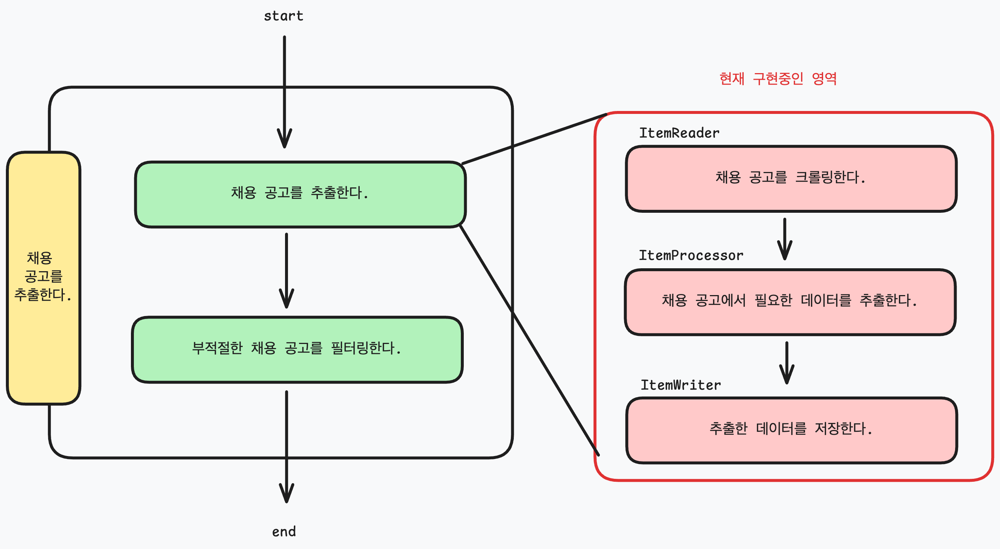

## Job Posting Collector 동작 정리

### 배치 구성

구현한 전체 구성은 다음과 같다.



배치에서 사용하는 객체는 다음처럼 표현한다.

- `Job` : 배치 작업의 실행 단위
- `Step` : `Job`에서 실행할 단계이며 `Reader`, `Processor`, `Writer`로 구성
- `Reader` : 데이터를 읽어오는 역할
- `Processor` : 데이터를 가공하는 역할
- `Writer` : 데이터를 저장하는 역할

`Job`은 다음처럼 구현했다.

```java

@Configuration
public class BatchConfiguration {
    // highlight-start
    @Bean
    Job collectorJob(
            JobRepository jobRepository,
            Step collectJobPostingStep
    ) {
        return new JobBuilder(COLLECTOR_JOB, jobRepository)
                .start(collectJobPostingStep)
                .build();
    }
    // highlight-end
}
```

`Step`은 다음처럼 구현했다.

- `chunk` : 데이터 커밋 단위다. `chunk` 단위로 데이터를 읽어오고, 가공하고, 저장한다.
- `transactionManager` : 트랜잭션 매니저를 설정한다. 해당 `transactionManager`를 사용해 chunk 단위로 데이터를 커밋한다.
- `jobRepository` : `JobRepository`를 사용해 배치 작업을 관리한다. `JobRepository`는 작업 정보, 실행 정보를 관리한다.

```java

@Configuration
public class BatchConfiguration {
    // highlight-start
    @Bean
    Step collectJobPostingStep(
            JobRepository jobRepository,
            PlatformTransactionManager transactionManager,
            ItemReader<TargetSource> findTargetJobPostingReader,
            ItemProcessor<TargetSource, String> collectJobPostingProcessor,
            ItemWriter<String> saveJobPostingWriter
    ) {
        return new StepBuilder(COLLECT_JOB_POSTING, jobRepository)
                .<TargetSource, String>chunk(CHUNK_SIZE, transactionManager)
                .reader(findTargetJobPostingReader)
                .processor(collectJobPostingProcessor)
                .writer(saveJobPostingWriter)
                .build();
    }
    // highlight-end
}
```

Reader, Processor, Writer 구성은 다음과 같다.

- `findTargetJobPostingReader` : 데이터를 크롤링한다.
- `collectJobPostingProcessor` : 크롤링한 데이터를 가공한다.
- `saveJobPostingWriter` : 가공한 데이터를 저장한다. (현재는 콘솔에 출력한다.)

```java

@Configuration
public class BatchConfiguration {
    // highlight-start
    @Bean
    ItemReader<TargetSource> findTargetJobPostingReader(
            FindJobPostingService findJobPostingService
    ) {
        var targetSources = findJobPostingService.execute().iterator();
        return () -> {
            if (!targetSources.hasNext()) {
                return null;
            }
            return targetSources.next();
        };
    }
    // highlight-end

    // highlight-start
    @Bean
    ItemProcessor<TargetSource, String> collectJobPostingProcessor(
            ExtractJobPostingService extractJobPostingService
    ) {
        return extractJobPostingService::execute;
    }
    // highlight-end

    // highlight-start
    @Bean
    ItemWriter<String> saveJobPostingWriter() {
        return items -> {
            for (String item : items) {
                System.out.println(item);
            }
        };
    }
    // highlight-end
}
```

### 비즈니스 로직 구성

`FindJobPostingService.java`에서 크롤링할 사이트를 주입한다.
현재는 `TargetSource`에서 크롤링할 사이트를 정의하고, 해당 사이트를 크롤링한다.

```java
@Service
public class FindJobPostingService {
    public List<TargetSource> execute() {
        return Arrays.stream(TargetSource.values()).toList();
    }
}

```

`ExtractJobPostingService.java`에서 크롤링한 데이터를 가공한다.
`TargetSource`와 `Extractor` 클래스를 생성해서 추가한다.

```java
@Service
public class ExtractJobPostingService {
    public String execute(TargetSource item) throws Exception {
        return switch (item) {
            // highlight-start
            case NAVER -> new NaverJobPostingExtractor(item.getUrl()).extract();
            // highlight-end
            case NHN -> "NHN";
            case KAKAO -> "KAKAO";
        };
    }
}
```

## Batch 동작 정리

### Job 실행하는 방법

배치에서 Job을 등록하면 `ApplicationRunner`를 상속받은 `JobLauncherApplicationRunner`로 인해 자동으로 실행된다.
배치 작업 등록은 `yaml` 파일에서 간단하게 등록 가능하다.

```yaml
spring:
  batch:
    job:
      name: JOB_NAME
```

`BatchAutoConfiguration.java` 에서 `BatchProperties.java` 값을 읽어 실행한다.
`@ConditionalOnMissingBean`, `@ConditionalOnProperty`에서 확인할 수 있듯이 `spring.batch.job.enabled` 값이 `true`일 경우에만 실행된다. (기본값은 `true`이므로 신경쓰지 않아도 된다.)
실행된다면 `runner`는 등록된 `jobName`(spring.batch.job.name)을 실행한다.

```java
public class BatchAutoConfiguration {
    // ...

    // highlight-start
    @Bean
    @ConditionalOnMissingBean
    @ConditionalOnProperty(prefix = "spring.batch.job", name = "enabled", havingValue = "true", matchIfMissing = true)
    public JobLauncherApplicationRunner jobLauncherApplicationRunner(JobLauncher jobLauncher, JobExplorer jobExplorer,
                                                                     JobRepository jobRepository, BatchProperties properties) {
        JobLauncherApplicationRunner runner = new JobLauncherApplicationRunner(jobLauncher, jobExplorer, jobRepository);
        String jobName = properties.getJob().getName();
        if (StringUtils.hasText(jobName)) {
            runner.setJobName(jobName);
        }
        return runner;
    }
    // highlight-end
    // ...
}
```

